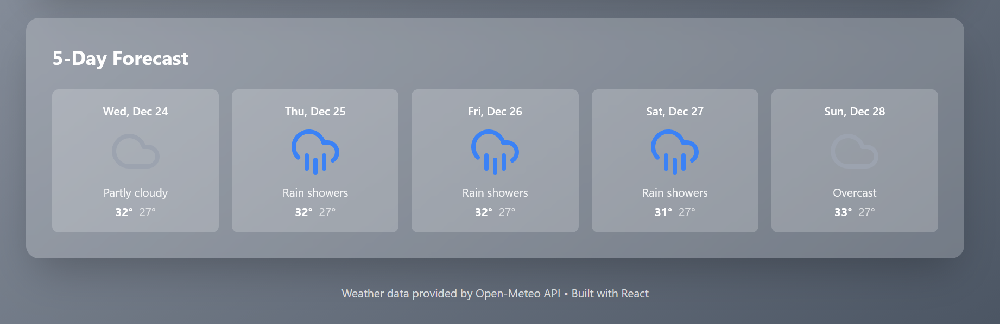
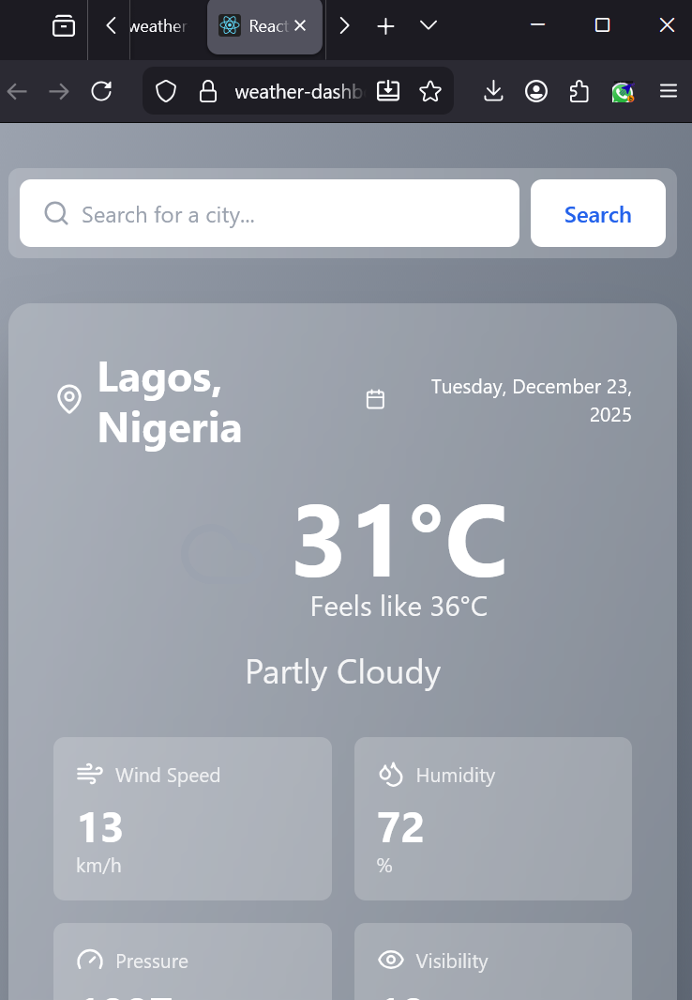
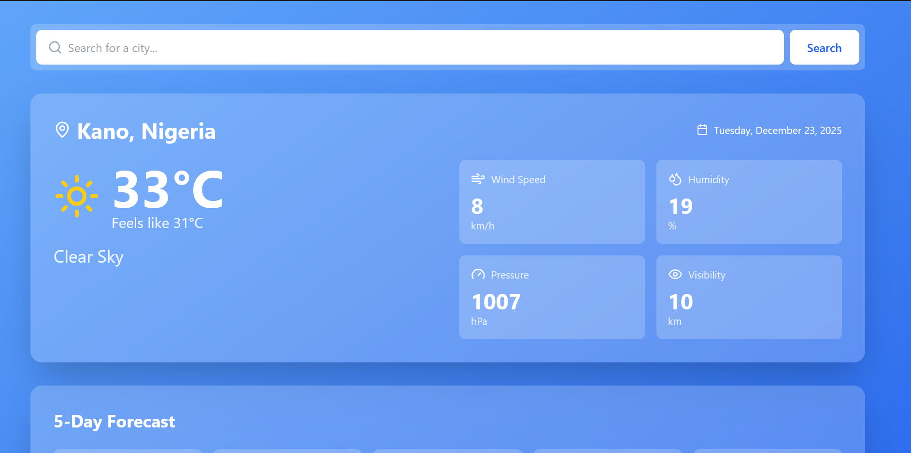

# 🌤️ Weather Dashboard

A beautiful, real-time weather application that provides current weather conditions and 5-day forecasts for any city worldwide. Features dynamic backgrounds that change based on weather conditions and a sleek glassmorphism design.


## ✨ Features

- 🌍 **Global Coverage** - Search and get weather for any city worldwide
- 🌡️ **Real-time Data** - Current temperature, feels-like temperature, and weather conditions
- 📅 **5-Day Forecast** - Extended forecast with daily highs and lows
- 💨 **Detailed Metrics** - Wind speed, humidity, atmospheric pressure, and visibility
- 🎨 **Dynamic Backgrounds** - UI changes color based on current weather conditions
- 🔍 **Smart Search** - Easy city search with instant results
- 📱 **Fully Responsive** - Optimized for desktop, tablet, and mobile devices
- ⚡ **Fast Loading** - Efficient API calls with loading states
- 🎯 **No API Key Required** - Uses free Open-Meteo API service
- 💎 **Modern UI** - Glassmorphism design with smooth animations

## 🚀 Live Demo

[View Live Demo](https://weather-dashboard-lac-tau.vercel.app/)

## 📸 Screenshots






````


## 🛠️ Built With

**Frontend:**

- **React** - JavaScript library for building user interfaces
- **React Hooks** - useState and useEffect for state management

**Styling:**

- **Tailwind CSS** - Utility-first CSS framework
- **Lucide React** - Beautiful open-source icons

**APIs:**

- **Open-Meteo Weather API** - Free weather data service
- **Open-Meteo Geocoding API** - City name to coordinates conversion

## 📦 Installation & Setup

### Prerequisites

- Node.js (v14 or higher)
- npm or yarn package manager

### Step-by-Step Setup

1. **Clone the repository**

```bash
git clone https://github.com/TPADEJUWON/weather-dashboard.git
cd weather-dashboard
````

2. **Install dependencies**

```bash
npm install
```

3. **Install Tailwind CSS and related packages**

```bash
npm install -D tailwindcss@3.4.17 postcss autoprefixer
npx tailwindcss init -p
```

4. **Install Lucide React icons**

```bash
npm install lucide-react
```

5. **Configure Tailwind CSS**

Update `tailwind.config.js`:

```javascript
/** @type {import('tailwindcss').Config} */
module.exports = {
  content: ["./src/**/*.{js,jsx,ts,tsx}"],
  theme: {
    extend: {},
  },
  plugins: [],
};
```

Update `src/index.css`:

```css
@tailwind base;
@tailwind components;
@tailwind utilities;
```

6. **Start the development server**

```bash
npm start
```

7. **Open your browser**

Navigate to `http://localhost:3000`

## 📖 How to Use

1. **Initial Load**: The app loads with weather data for Lagos by default
2. **Search for a City**:
   - Type any city name in the search bar
   - Press Enter or click the Search button
   - View updated weather information
3. **View Current Weather**:
   - See temperature, feels-like temp, and weather description
   - Check detailed metrics: wind speed, humidity, pressure
4. **Check Forecast**:
   - Scroll down to view the 5-day forecast
   - See daily high and low temperatures
   - Preview weather conditions for upcoming days

## 🏗️ Project Structure

```
weather-dashboard/
├── public/
│   ├── index.html
│   └── favicon.ico
├── src/
component
│   ├── App.js                       # Root component
│   ├── index.js                     # Entry point
│   └── index.css                    # Global styles with Tailwind
├── .gitignore
├── package.json
├── tailwind.config.js               # Tailwind configuration
├── postcss.config.js                # PostCSS configuration
└── README.md
```

## 🎯 Key Components & Features

### Weather Data Fetching

```javascript
// Geocoding: Convert city name to coordinates
const geoResponse = await fetch(
  `https://geocoding-api.open-meteo.com/v1/search?name=${cityName}`
);

// Weather: Get current conditions and forecast
const weatherResponse = await fetch(
  `https://api.open-meteo.com/v1/forecast?latitude=${lat}&longitude=${lon}&current=...&daily=...`
);
```

### Dynamic Background Colors

The app changes its background gradient based on weather conditions:

- **Clear Sky** - Blue gradient
- **Cloudy** - Gray gradient
- **Rainy** - Deep blue gradient

### Error Handling

- Network error handling with user-friendly messages
- City not found error handling
- Retry functionality for failed requests

## 🌐 API Information

### Open-Meteo Weather API

- **Base URL**: `https://api.open-meteo.com/v1/forecast`
- **Cost**: Completely free, no API key required
- **Rate Limit**: Generous limits for personal projects
- **Data**: Temperature, humidity, wind speed, pressure, weather codes

### Open-Meteo Geocoding API

- **Base URL**: `https://geocoding-api.open-meteo.com/v1/search`
- **Purpose**: Convert city names to GPS coordinates
- **Coverage**: Global city database

### Weather Code Meanings

- `0-1`: Clear sky
- `2-3`: Partly cloudy to overcast
- `51-67`: Drizzle to rain
- `71-77`: Snow
- `80+`: Rain showers

## 💡 What I Learned

Building this project helped me understand:

- Working with external REST APIs
- Handling asynchronous operations with async/await
- Managing loading and error states
- Dynamic styling based on data
- Creating responsive layouts with Tailwind CSS
- Component lifecycle with React hooks
- Error handling and user feedback

## 🔮 Future Enhancements

Planned features for future versions:

- [ ] **Hourly Forecast** - Show weather by hour for the next 24 hours
- [ ] **Temperature Units** - Toggle between Celsius and Fahrenheit
- [ ] **Geolocation** - Automatically detect user's location
- [ ] **Favorite Cities** - Save frequently checked locations
- [ ] **Weather Alerts** - Display severe weather warnings
- [ ] **Historical Data** - View past weather trends
- [ ] **Air Quality Index** - Show pollution levels
- [ ] **UV Index** - Display sun exposure information
- [ ] **Weather Maps** - Interactive radar and satellite maps
- [ ] **Dark Mode** - Toggle between light and dark themes
- [ ] **Multiple Languages** - i18n support

## 🧪 Testing

To run the app locally and test:

```bash
# Start development server
npm start

# Build for production
npm run build

# Test production build locally
npm install -g serve
serve -s build
```

## 🚀 Deployment

### Deploy to Vercel (Recommended)

1. **Push your code to GitHub**

```bash
git add .
git commit -m "Initial commit"
git push origin main
```

2. **Deploy on Vercel**

- Go to [vercel.com](https://vercel.com)
- Import your GitHub repository
- Vercel auto-detects React settings
- Click Deploy

3. **Get your live URL**

- Vercel provides: `https://weather-dashboard-xyz.vercel.app`

### Deploy to Netlify

```bash
# Install Netlify CLI
npm install -g netlify-cli

# Build the project
npm run build

# Deploy
netlify deploy --prod --dir=build
```

## 🤝 Contributing

Contributions are welcome! Here's how you can help:

1. Fork the repository
2. Create a feature branch (`git checkout -b feature/AmazingFeature`)
3. Commit your changes (`git commit -m 'Add some AmazingFeature'`)
4. Push to the branch (`git push origin feature/AmazingFeature`)
5. Open a Pull Request

## 🐛 Known Issues

- Visibility data is currently static (10km) - Open-Meteo doesn't provide this metric
- Some smaller cities may not be found in the geocoding database
- Weather descriptions are basic - could be more detailed

## 📄 License

This project is open source and available under the [MIT License](LICENSE).

## 👨‍💻 Author

**Tosin Adejuwon**

- GitHub: [@TPADEJUWON](https://github.com/TPADEJUWON)
- Email: tosin0601@gmail.com
- Portfolio: [My Portfolio](https://portfolio-umber-two-42.vercel.app/)\_
- LinkedIn: https://www.linkedin.com/in/tosin-adejuwon-08507b110/

## 🙏 Acknowledgments

- Weather data provided by [Open-Meteo](https://open-meteo.com/) - Free weather API
- Icons from [Lucide](https://lucide.dev) - Beautiful open-source icon library
- Styled with [Tailwind CSS](https://tailwindcss.com) - Utility-first CSS framework
- Built with [React](https://react.dev) - JavaScript library for building user interfaces

## 📞 Support

If you have any questions or need help, feel free to:

- Open an issue on GitHub
- Email me at tosin0601@gmail.com
- Connect with me on LinkedIn

## ⭐ Show Your Support

If you found this project helpful or interesting, please give it a star on GitHub! It helps others discover the project and motivates me to keep improving it.

---

**Made with ❤️ by Tosin Adejuwon**
